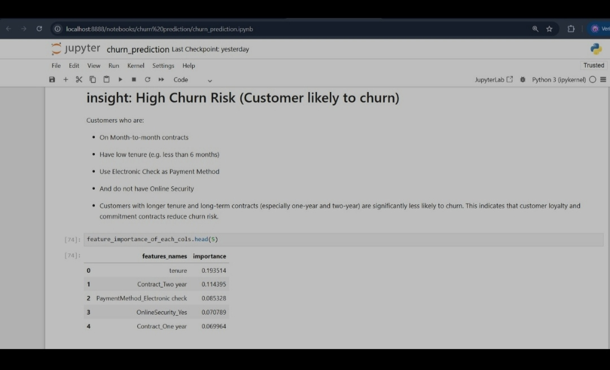
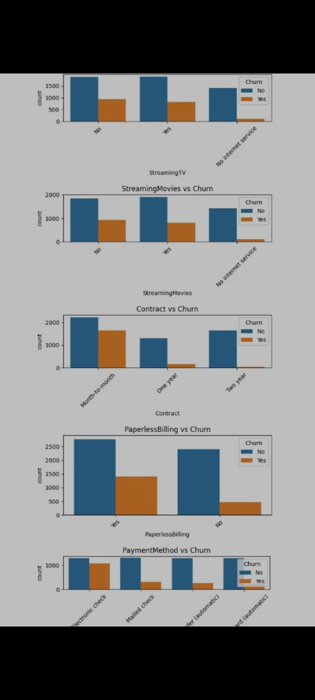

# 🔁 Customer Churn Prediction using EDA & ML

This project focuses on identifying customers who are likely to churn using machine learning and exploratory data analysis (EDA).  
The dataset used includes telecom customer data with multiple service and demographic features. The goal is to understand churn behavior and build a predictive model to flag at-risk customers.

---

## 📊 Dashboard & Visual Insights




---

## ✅ Highlights

- Performed deep **Exploratory Data Analysis** with plots
- Built interpretable ML models to **predict churn probability**
- Extracted **feature importance** and generated clear business **insights**
- No Streamlit UI yet — focused on Jupyter-based analysis

---

## 🧠 Key Business Insights

Customers more likely to churn:
- Are on **month-to-month** contracts
- Have **tenure < 6 months**
- Use **Electronic Check** as a payment method
- **Do not** have **Online Security**

Customers with:
- **1 or 2-year contracts**
- **Higher tenure**
- And secure services  
are significantly less likely to churn.

---

## 🔍 Feature Importance (Top 5)

| Feature                     | Importance |
|----------------------------|------------|
| `tenure`                   | 0.1935     |
| `Contract_Two year`        | 0.1143     |
| `PaymentMethod_Electronic`| 0.0853     |
| `OnlineSecurity_Yes`      | 0.0707     |
| `Contract_One year`       | 0.0699     |

---

## 📁 Folder Contents

```
📦 churn-predicter
┣ 📁 churn_prediction
┃  ┗ churn_prediction.ipynb
┣ 📄 data.csv
┣ 📄 README.md  ← (this file)
```

---

## 🔧 How to Run

```bash
# Clone the repo
git clone https://github.com/DataShoaib/churn-predicter.git
cd churn-predicter

# Open the notebook
jupyter notebook churn_prediction/churn_prediction.ipynb
```

---

## 🧰 Tools & Libraries Used

- **Python 3**
- **Pandas, NumPy**
- **Matplotlib, Seaborn**
- **scikit-learn**
- **Jupyter Notebook**

---

## 📌 Use-Cases

- Customer churn analysis in telecom and SaaS
- Feature analysis for contract/customer retention
- Risk flagging and loyalty targeting
- Business dashboards for CX & marketing

---

## 🔮 Future Improvements

- 📈 Add Streamlit dashboard for predictions
- 📊 Include SHAP for model explainability
- 💬 Build alert systems for high-risk users

---

## 👨‍💻 Author

**Shoaib Akhtar**  
📧 Email: [mdshoaib478@gmail.com](mailto:mdshoaib478@gmail.com)  
💻 GitHub: [DataShoaib](https://github.com/DataShoaib)

---

## ⭐ Support

If this project helped you understand churn prediction or build your own, don’t forget to ⭐ star the repo!

---
